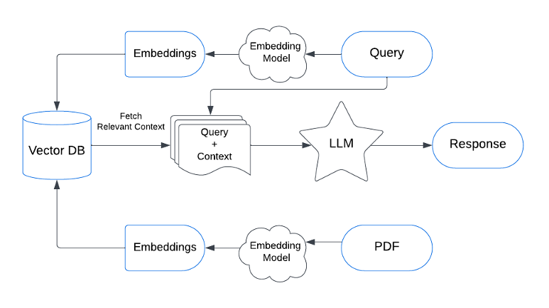

# SKPRAGProfile
A RAG enabled LLM against Sundarkp's profile. 

**Overview**

With an increased interest in Gen AI, LLM and RAG all around, my attempt to implement a RAG application enhanced by LLM. 

**What the Application does?**

The application loads my profile (which is in PDF), vectorizes it, stores it in a Vector DB. The queries run against the vector DB. The result is set as context for the conversation with LLM (OpenAI) and responses are generated.  

The application can be seen working at https://sundarkp.streamlit.app (A little slow as it is hosted on Streamlit Community Cloud)

**High Level Design**
  
  

**Concept** 

    •	LLM framework provides support for Document Loading, Splitting, creating Embeddings. LangChain Community is the one employed in the application
    
    •	Vectorization is an important element in RAG and LLM. Based on the semantic and structural aspects of words and sentences, the text is transformed into a numerical representation and stored in Vector Databases. For instance, Dog and Cat will be closer nodes with stronger weighted connections (as both are pets) than a Dog and a Iron rod. 
    
        o	For generating vectors, I use HuggingFaceBgeEmbedding trained on bge-large-en-v1.5 language model. The Large Language model, having trained on copious amount of text, is better placed to transform the swarths of text into numerical vectors. 
        o	Employed Pinecone as the vector database and it requires API key. 
    
    •	Streamlit App was easy to start with and is used for the visualization

**Tech Stack**

Vector Database – Pinecone

LLM – OpenAI

LLM/RAG Framework – langchain

Embedding Model – HuggingFaceEmbedding (BAAI/bge-large-en-v1.5)

PDF Parser – PyPDF

Language – Python

**Code**

[Github Link](https://github.com/clicksuku/SundarkpCode/blob/master/RAG_LLM_Profile(PineCone%2C%20OpenAI%2C%20Python)/Skp_RAGApp.py)

**References**

***Articles***

https://www.dailydoseofds.com/a-crash-course-on-building-rag-systems-part-2-with-implementations/ 
https://dev.to/rogiia/how-to-build-a-basic-rag-app-h9p
Videos
https://www.youtube.com/watch?v=1y2TohQdNbo&t=65s 
https://www.youtube.com/watch?v=1y2TohQdNbo&t=65s 

***Chat Models***
https://python.langchain.com/docs/integrations/chat/ 

***Embeddings***

https://zilliz.com/learn/enhancing-information-retrieval-learned-sparse-embeddings#Summary 
https://medium.com/@zilliz_learn/exploring-bge-m3-and-splade-two-machine-learning-models-for-generating-sparse-embeddings-0772de2c52a7 

**Vector Databases**

***Pinecone***
https://python.langchain.com/docs/integrations/retrievers/self_query/pinecone/
https://docs.llamaindex.ai/en/stable/examples/vector_stores/PineconeIndexDemo/ 

***FAISS***
https://medium.com/@ahmed.mohiuddin.architecture/using-ai-to-chat-with-your-documents-leveraging-langchain-faiss-and-openai-3281acfcc4e9

***Milvus***
https://github.com/milvus-io/bootcamp/tree/master

